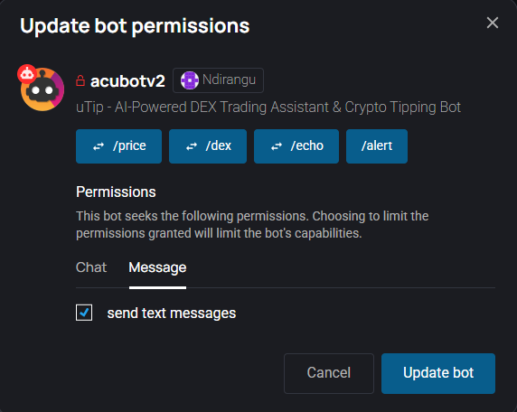
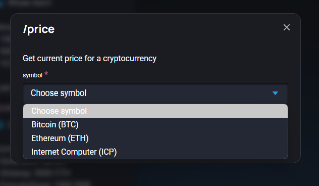
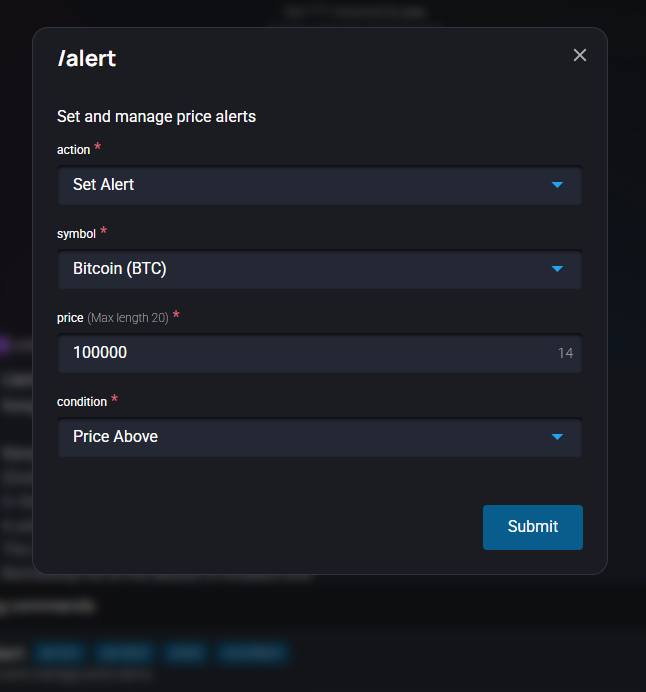
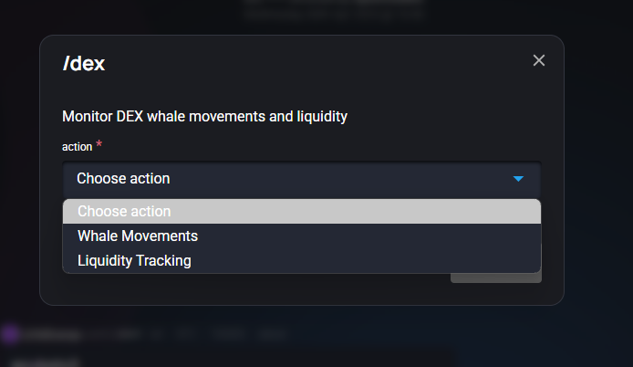
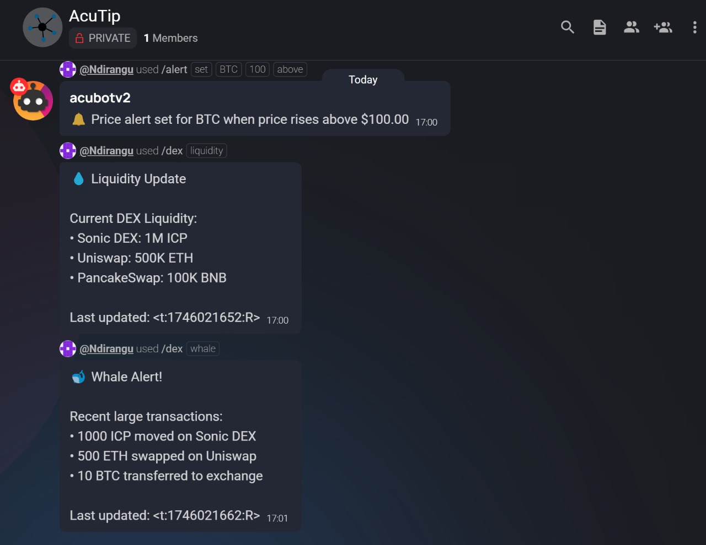

# AcuTip - OpenChat Crypto Bot

AcuTip is a powerful OpenChat bot designed to help users monitor cryptocurrency prices, set price alerts, and track DEX (Decentralized Exchange) activities. Built with Rust using the OpenChat Bot SDK, it provides real-time cryptocurrency information and alerts.



## Features

### 1. Price Monitoring (`/price`)
- Real-time cryptocurrency price checking
- Supported cryptocurrencies:
  - Bitcoin (BTC)
  - Ethereum (ETH)
  - Internet Computer (ICP)
- Clean and intuitive interface with dropdown selection


### 2. Price Alerts (`/alert`)
- Set custom price alerts for cryptocurrencies
- Multiple alert types:
  - Price above threshold
  - Price below threshold
- Alert management commands:
  - `/alert set` - Create new price alerts
  - `/alert list` - View all active alerts
  - `/alert remove` - Remove existing alerts
- Real-time notifications when price conditions are met


### 3. DEX Monitoring (`/dex`)
- Track decentralized exchange activities
- Two monitoring modes:
  - `whale` - Monitor large transactions
  - `liquidity` - Track liquidity pools
- Features:
  - Whale movement tracking
  - Liquidity pool monitoring
  - Transaction volume tracking
  - Real-time updates


## Installation

1. Clone the repository:
```bash
git clone https://github.com/yourusername/acutip.git
cd acutip
```

2. Install the required dependencies:
```bash
cargo build
```

3. Create a new identity for your bot:
```bash
dfx identity new acubot_identity --storage-mode=plaintext
```

4. Export the identity to PEM file:
```bash
dfx identity export acubot_identity > identity.pem
```

5. Create a config.toml file:
```toml
pem_file = "./identity.pem"
ic_url = "https://icp0.io"
port = 13457
oc_public_key = "YOUR_OC_PUBLIC_KEY"
log_level = "INFO"
```

## Bot Registration

1. Visit [OpenChat](https://oc.app)

2. Create a new group or use an existing one

3. Register your bot:
   - Type `/bots` in the chat
   - Click "Register a Bot"
   - Fill in the bot details:
     - Name: AcuTip
     - Description: Crypto price monitoring and DEX tracking bot
     - Avatar: Upload a bot avatar (optional)
   - For the bot URL, use your local server address:
     ```
     http://localhost:13457
     ```
   - Click "Register"

4. Add the bot to your group:
   - Type `/add @AcuTip` in the group chat
   - The bot will join the group and be ready to use

## Detailed Usage Guide



### Price Checking
1. Type `/price` in the chat
2. Select a cryptocurrency from the dropdown (BTC, ETH, or ICP)
3. Click "Submit"
4. The bot will respond with the current price:
   ```
   💰 Current BTC price: $93867.00
   ```

### Setting Price Alerts
1. Type `/alert set` in the chat
2. Fill in the alert details:
   - Select cryptocurrency (BTC, ETH, or ICP)
   - Enter target price (e.g., 80000)
   - Choose condition (above/below)
3. Click "Submit"
4. The bot will confirm:
   ```
   🔔 Price alert set for BTC when price falls below $80000.00
   ```

### Managing Alerts
1. List your alerts:
   ```
   /alert list
   ```
   Response shows all active alerts:
   ```
   📋 Your Price Alerts:
   • BTC below $80000.00 (set 2024-04-30 17:59)
   ```

2. Remove an alert:
   ```
   /alert remove BTC
   ```
   Bot confirms:
   ```
   ✅ Removed price alert for BTC
   ```

### DEX Monitoring
1. Monitor whale movements:
   ```
   /dex whale
   ```
   Shows large transactions:
   ```
   🐋 Whale Alert!
   • 1000 ICP moved on Sonic DEX
   • 500 ETH swapped on Uniswap
   • 10 BTC transferred to exchange
   ```

2. Check liquidity:
   ```
   /dex liquidity
   ```
   Shows current liquidity:
   ```
   💧 Liquidity Update
   • Sonic DEX: 1M ICP
   • Uniswap: 500K ETH
   • PancakeSwap: 100K BNB
   ```

### Best Practices
- Set reasonable price alert thresholds
- Use the list command to manage multiple alerts
- Monitor DEX activities for market insights
- Remove unused alerts to keep your list clean

## Usage

1. Start the bot:
```bash
cargo run
```

2. Available Commands:
   - Check cryptocurrency prices:
     ```
     /price BTC
     ```
   - Set a price alert:
     ```
     /alert set BTC 80000 below
     ```
   - Monitor DEX activities:
     ```
     /dex whale
     /dex liquidity
     ```

## Configuration

The bot can be configured through the `config.toml` file:
- `pem_file`: Path to your identity PEM file
- `ic_url`: Internet Computer URL
- `port`: Port number for the bot server
- `oc_public_key`: OpenChat public key
- `log_level`: Logging level (INFO, DEBUG, etc.)

## Development

### Prerequisites
- Rust
- DFX (for identity management)
- Internet Computer SDK

### Project Structure
```
acutip/
├── src/
│   ├── commands/
│   │   ├── alert.rs
│   │   ├── dex.rs
│   │   ├── price.rs
│   │   └── mod.rs
│   ├── config.rs
│   └── main.rs
├── Cargo.toml
├── config.toml
└── README.md
```

## Contributing

1. Fork the repository
2. Create your feature branch (`git checkout -b feature/AmazingFeature`)
3. Commit your changes (`git commit -m 'Add some AmazingFeature'`)
4. Push to the branch (`git push origin feature/AmazingFeature`)
5. Open a Pull Request

## License

This project is licensed under the MIT License - see the [LICENSE](LICENSE) file for details.

## Acknowledgments

- Built with [OpenChat Bot SDK](https://github.com/open-chat-labs/open-chat-bots)
- Uses CoinGecko API for cryptocurrency price data
- Special thanks to the Internet Computer community

## Support

For support, please open an issue in the GitHub repository or contact the maintainers. 

